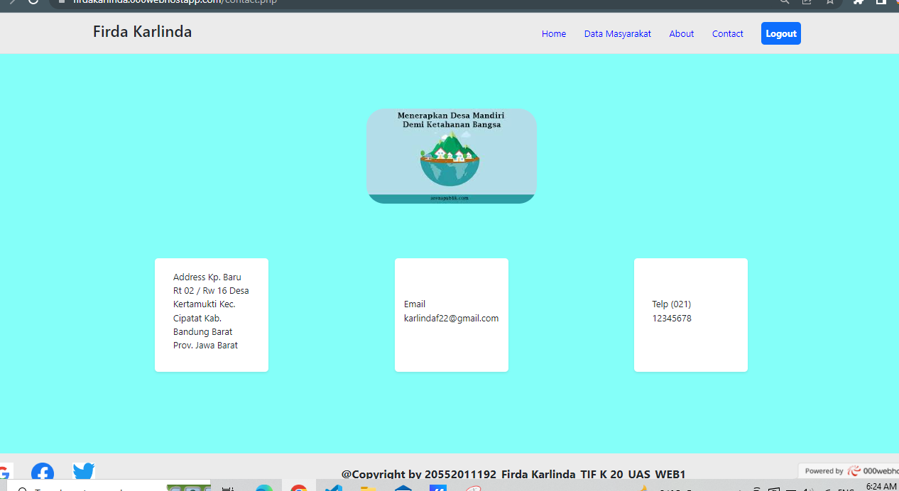

# dataKelurahan

 <p align="center">
    Firda Karlinda - 20552011193 - TIF K 20
   <br></br>
    <a href="https://firdakarlinda.000webhostapp.com/dataKelurahan"><strong>Buka Website</strong></a>


#Aplikasi CRUD dengan PHP dan MySQL (Procedural Style)

 Bahasa Pemrograman 	: PHP,
 Database		        : MySQL (Ekstensi MySQL),
 Template		        : Bootstrap 5

# Fitur
1. Create
2. Read
3. Update
4. Delete
5. Search
6. Penggunaan CSS Bootstrap 5

### Koneksi Database

script php untuk mengkoneksikan ke database. 
       
          * <?php
          $server= "localhost";
          $dbuser= "root";
          $dbpass = "";
          $dbname = "website";
          $conn = mysqli_connect($server, $dbuser, $dbpass, $dbname);
          if (!$conn) {
          echo "Connection failed!";
          }
          ```
<!-- screenshot-page -->

## Screenshot Page

Screenshot diambil dari website 000webhost setelah project di hosting

*Halaman Register
<p align="center">
   
  </p> <br>
  
*Halaman Login
<p align="center">
   
</p> <br>

*Halaman Utama
<p align="center">
  
</p> <br>

*Halaman Pelayanan Masyarakat
<p align="center">
  
</p> <br> 

*Halaman Info BLT
<p align="center">
  
</p><br>

*Halaman E-KTP
<p align="center">
  
</p><br>

*Halaman About
<p align="center">
  
</p><br>

*Halaman Contact
<p align="center">
  
</p> <br>

*Halaman CRUD Tambah Data, Upadate, Delete
<p align="center">
  
 <br>
  
</p> <br>


